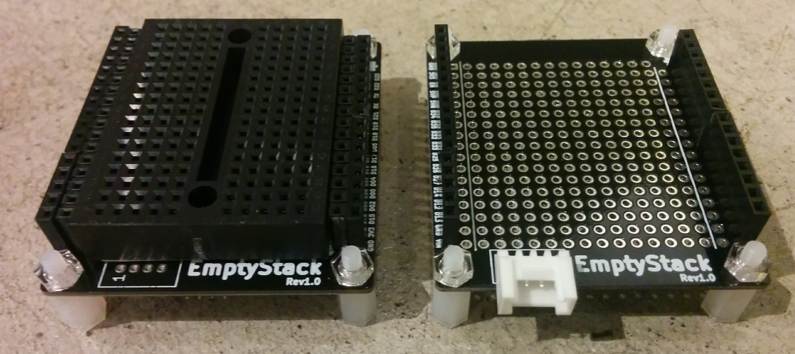

# EmptyStack
A kicad project of empty stacking board.

In combination with [ESP32Stack](https://github.com/asukiaaa/esp32stack).

# License
MIT

# References
- [ESP32Stack](https://github.com/asukiaaa/esp32stack)